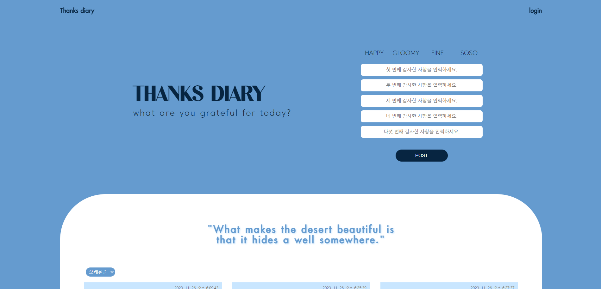

## 프로젝트명

: Thanks Diary

## 개발 기간

: 23.11.21 ~ 23.11.27

## 프로젝트 설명

: 감사일기를 작성하고 여러 사람과 소통할 수 있는 뉴스피드 제작

## 배포링크

: **https://thanksdiary8-chi.vercel.app/**

## 프로젝트 설치 및 실행 방법

- firebase api를 환경변수 설정을 통해 비공개해두었습니다. 코드를 clone해 실행하시려면 firebase.js에서 api 설정이 필요합니다.

#### 개발환경 및 사용 기능

**_package.json 파일 참고_**

- firestore
- firebase authentication
- firebase storage
- styled-components
- react app
- react-icons
- redux

## 주요 기능

- 회원가입/로그인 (이메일, 구글로그인, 깃허브 로그인)
- 감사 일기 작성 기능
- 댓글 작성 기능
- 게시물 모아보기, 수정/삭제 기능
- 프로필 이미지/이름 수정 기능
